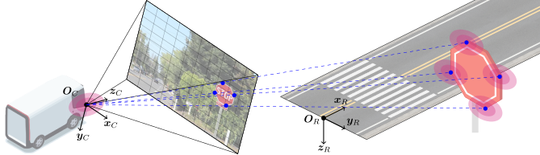
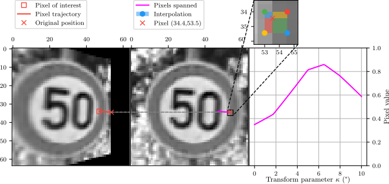
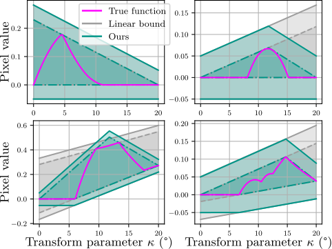

<p align="center">
   <h1 align="center">
      Lipschitz Optimization for Formal Verification of Homographies
   </h1>

   <p align="center">
      <a href="https://arxiv.org/abs/2605.23203">
         </a>
      &nbsp;
      <a href="https://github.com/jeangud/homography-verification">
         </a>
      &nbsp;
      <a href="https://github.com/jeangud/vbl-verification/actions/workflows/build-and-test.yml">
         </a>
      &nbsp;
      <a href=".github/reports/coverage.txt"></a>
      &nbsp;
      <a href="https://github.com/astral-sh/ruff"></a>
      &nbsp;
      <a href="https://github.com/jeangud/homography-verification/pkgs/container/homography-verification-ci">
         </a>
   </p>

   <p align="center">
      <a href="https://www.linkedin.com/in/jeanguillaumedurand">Jean-Guillaume Durand</a>
      ·
      <a href="https://pkouvaros.github.io/">Panagiotis Kouvaros</a>
      ·
      <a href="https://www.linkedin.com/in/maxime-gariel">Maxime Gariel</a>
      ·
      <a href="https://www.doc.ic.ac.uk/~alessio/">Alessio Lomuscio</a>
   </p>

   <h2 align="center">
      <!-- <p>CVPR 2026</p> -->
      <a href="https://cvpr.thecvf.com/virtual/2026/poster/37169" align="center">📍CVPR 2026</a> | 
      <a href="https://arxiv.org/abs/2605.23203" align="center">📄 Paper</a> |
      <a href="https://github.com/jeangud/homography-verification" align="center">💻 Code</a>
   </h2>
</p>

> [!NOTE]
> 🚧 **Code coming soon** — around CVPR 2026.

<p align="center">
   
   <br>
   Deploying vision neural networks in safety-critical domains requires formal robustness guarantees, but current verifiers struggle with 3D camera motion. In this repository, we calculate tight piecewise-linear bounds on pixel values for 3D geometric perturbations. These bounds can then be used in complete verifiers such as <a href="https://github.com/vas-group-imperial/venus2">VENUS</a>.
</p>

**BibTeX citation:**
```bibtex
@inproceedings{durand2026lipschitz,
    title     = {Lipschitz Optimization for Formal Verification of Homographies},
    author    = {Durand, Jean-Guillaume and Kouvaros, Panagiotis and Gariel, Maxime and Lomuscio, Alessio},
    booktitle = {Proceedings of the Computer Vision and Pattern Recognition Conference (CVPR)},
    year      = {2026}
}
```

As the rotation angle varies from 0 to 10 degrees, the value of pixel (i,j) changes:
<p align="center">
   
   <br>
</p>

We derive piecewise linear (PWL) bounds which encompass the pixel value function.
This convex polytope can then be propagated through a neural network verifier for
robustness verification:
<p align="center">
   
   <br>
</p>

## 🛠️ Installation
> ✅ **No GPU required!**

We recommend managing a Python 3.10 installation through [miniconda](https://docs.anaconda.com/miniconda/) or [pyenv](https://github.com/pyenv/pyenv).
From the root directory of the repository:
```shell
pip install .
```

Some of the figures render better with a [$\LaTeX$ installation](https://www.latex-project.org/get/).

## 🚀 Usage
> ℹ️ The current implementation runs in 4 minutes on a 32x32 image.

The [scripts](./scripts) directory is the main entry point for users, we list below some use cases.

The linear programming step uses [Gurobi](https://www.gurobi.com/) by default. If no Gurobi license is available, you can use [SciPy](https://scipy.org/) as a fallback by passing `--solver SCIPY`.

### Example 1: Generating bounds (MNIST)
We first generate bounds for a simple 2D rotation of 20 degrees on the first 7 MNIST images:
```shell
python ./scripts/calculate_bounds.py --transformation ROTATE --lower 0 --upper 0.349 --dataset MNIST --image-number 7
```

To view all the possible script options: `python ./scripts/calculate_bounds.py --help`.

<details>
<summary><b>Example output</b> (click to expand)</summary>

```shell
2025-01-03 06:06:49,516 [INFO] calculate_bounds.py:171 - User arguments: Namespace(transformations=[<TransformType.ROTATE: 1>], lower=[0.0], upper=[0.349], image_number=7, dataset_cls=None, dataset='MNIST', padding_value=0.5, num_samples=100, num_subdomain_samples=10, num_init_splits=124, num_splits=2, lipschitz_error=0.05, save=False, logging='INFO')
2025-01-03 06:06:49,516 [INFO] calculate_bounds.py:173 - Loading dataset...
2025-01-03 06:06:49,522 [INFO] calculate_bounds.py:177 - Parsing transforms...
2025-01-03 06:06:49,522 [INFO] calculate_bounds.py:186 - Iterating over images
2025-01-03 06:06:49,523 [INFO] calculate_bounds.py:189 - Processing image MNIST[0]
2025-01-03 06:06:49,523 [INFO] calculate_bounds.py:189 - Processing image MNIST[1]
2025-01-03 06:06:49,523 [INFO] calculate_bounds.py:189 - Processing image MNIST[2]
2025-01-03 06:06:49,523 [INFO] calculate_bounds.py:189 - Processing image MNIST[3]
2025-01-03 06:06:49,524 [INFO] calculate_bounds.py:189 - Processing image MNIST[4]
2025-01-03 06:06:49,524 [INFO] calculate_bounds.py:189 - Processing image MNIST[5]
2025-01-03 06:06:49,524 [INFO] calculate_bounds.py:189 - Processing image MNIST[6]
2025-01-03 06:06:49,524 [INFO] calculate_bounds.py:189 - Processing image MNIST[7]
100%|███████████████████████████████████████████████████████████████████████████| 8/8 [00:00<00:00, 14357.91it/s]
2025-01-03 06:06:49,524 [INFO] calculate_bounds.py:263 - Done. Results saved under /home/john.doe/work/vnn/vbl-verification/bounds/MNIST/Rotation(14.0,14.0)[0.00,0.25]
```
</details>

### Example 2: Generating bounds (3D)
This is the main feature of the paper, generating bounds for a non-affine 3D transform. Here we use a yaw perturbation of 20 degrees on LARD:
```python
scripts/calculate_bounds.py --transformation H_YAW --lower 0 --upper 0.349 --dataset LARD --image-number 0 --padding 0 --lipschitz-error 0.05
```

<details>

<summary><b>Example output</b> (click to expand)</summary>

```shell
2025-01-03 12:26:19,774 [INFO] calculate_bounds.py:162 - User arguments: Namespace(transformations=[<TransformType.H_YAW: 8>], lower=[0.0], upper=[0.3490658503988659], image_number=0, dataset='LARD', padding_value=0.0, num_samples=100, num_subdomain_samples=10, num_init_splits=124, num_splits=2, lipschitz_error=0.05, logging='INFO')
2025-01-03 12:26:19,775 [INFO] calculate_bounds.py:164 - Loading dataset...
2025-01-03 12:26:19,775 [INFO] calculate_bounds.py:168 - Parsing transforms...
2025-01-03 12:26:19,790 [INFO] calculate_bounds.py:175 - Iterating over images
2025-01-03 12:26:19,793 [INFO] calculate_bounds.py:178 - Processing image LARD[0]
2025-01-03 12:26:19,805 [INFO] utils.py:95 - Plotting samples
2025-01-03 12:26:20,060 [INFO] utils.py:95 - Calculating bounds
2025-01-03 12:26:20,060 [INFO] utils.py:95 - Calculating unsound linear bounds
2025-01-03 12:26:26,955 [INFO] utils.py:95 - Adjusting to sound linear bounds
2025-01-03 12:27:35,053 [INFO] utils.py:95 - Time elapsed: 68.10 seconds
2025-01-03 12:28:36,515 [INFO] utils.py:95 - Time elapsed: 61.46 seconds
2025-01-03 12:28:36,515 [INFO] utils.py:95 - Calculating unsound piecewise-linear (PWL) bounds
2025-01-03 12:28:50,516 [INFO] utils.py:95 - Adjusting to sound piecewise-linear (PWL) bounds
2025-01-03 12:29:57,605 [INFO] utils.py:95 - Time elapsed: 67.09 seconds
2025-01-03 12:30:56,781 [INFO] utils.py:95 - Time elapsed: 59.18 seconds
2025-01-03 12:30:56,782 [INFO] utils.py:95 - Saving bounds to /home/jg.durand/work/vnn/vbl-verification/bounds/LARD/Homography[0.00,0.35]/0/bounds.pkl
2025-01-03 12:30:56,783 [INFO] utils.py:95 - Plotting bounds for all pixels
100%|████████████████████████████████████████████████████████████████████████████████████████████████████████████████████| 1/1 [10:12<00:00, 612.09s/it]
2025-01-03 12:36:31,882 [INFO] calculate_bounds.py:252 - Done. Results saved under /home/john.doe/work/vnn/vbl-verification/bounds/LARD/Homography[0.00,0.35]
```

</details>

### Example 3: Verifying bounds (CROWN)
You can then verify that network predictions are robust over the entire perturbation range.

This requires the `add-pwl` branch of our [auto_LiRPA fork](https://github.com/jeangud/auto_LiRPA/tree/add-pwl), which adds support for piecewise-linear bounds:
```shell
pip install "auto-lirpa @ git+https://github.com/jeangud/auto_LiRPA.git@add-pwl"
```

You will also need the model that was trained on the images from which the bounds were generated, and a CSV file listing the network output for each unperturbed image.
Then run the verification script:
```shell
python scripts/verify_bounds.py \
    --bounds-dir bounds/LARD/Homography/ \
    --model model.pt \
    --instances-csv instances.csv \
    --output-csv results.csv
```

<details>
<summary><b>Example output</b> (click to expand)</summary>

```
Detected input CHW=(3, 32, 32), num_classes=2, device=cpu
[1/20] 58: SAFE  target=1  margin=+3.8652e-01  mid=1 t0_pkl=1 t0_ds=1 label=1  t=0.79s
[2/20] 89: SAFE  target=1  margin=+2.1903e-01  mid=1 t0_pkl=1 t0_ds=1 label=1  t=0.23s
...
[20/20] 640: SAFE  target=1  margin=+4.0021e-01  mid=1 t0_pkl=1 t0_ds=1 label=1  t=0.22s

Summary:
  SAFE: 20
```

</details>

## 📊 Reproducing the paper
You can run the experiments scripts under [./scripts/experiments](./scripts/experiments/).

## 💾 Bounds format
The computed bounds are saved as a pickled dictionary with the following structure:

```python
data = pickle.load(f)
bounds = data["bounds"]
bounds[method][soundness][bound_type][i][j] # Bounds for pixel (i, j)
```

| Key            | Values                    | Description                                        |
|----------------|---------------------------|----------------------------------------------------|
| `method`       | `"linear"`, `"pwl"`       | Linear or piecewise-linear relaxation              |
| `soundness`    | `"sound"`, `"unsound"`    | Whether the bound is formally sound                |
| `bound_type`   | `"lower"`, `"upper"`      | Lower or upper bound                               |

- **Linear bounds** are stored as `[slope, intercept]`, representing the line $y = \text{slope} \cdot \kappa + \text{intercept}$ over the full parameter interval.
- **Piecewise-linear (PWL) bounds** are stored as an array of segments `[slope, intercept, start, end]`, each defining a line $y = \text{slope} \cdot \kappa + \text{intercept}$ valid on the sub-interval $[\text{start}, \text{end}]$.

See [`scripts/read_bounds.py`](./scripts/read_bounds.py) for an example of how to load and visualize the bounds.
